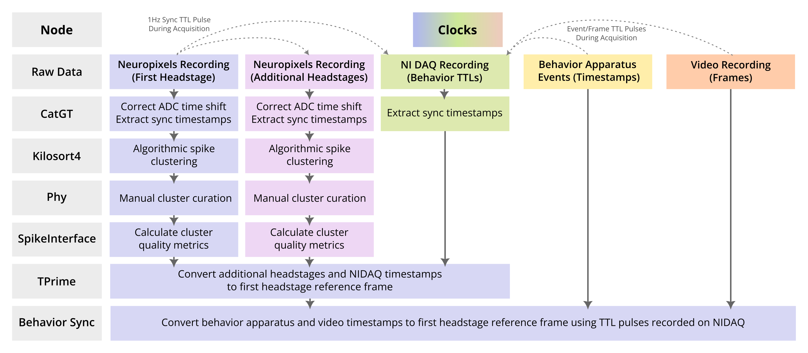

# NeuroDataPipeline: Automated Neuropixels Data Pre-Processing and Spike Sorting

This library is a lightweight automated pipeline for preprocessing, spike sorting, and syncing Neuropixels data recorded in SpikeGLX.

### Pipeline Steps

### Sync
During acquisition, the Neuropixels recording card sends 1Hz sync TTL pulses to all probes and the NI DAQ. You should also set up your behavior apparatus (e.g., Raspberry Pi or Arduino) and camera to send TTL pulses to the NI DAQ. The flowchart above shows how each data stream is processed and how each clock reference frame (indicated by color) is converted into the Neuropixels first headstage clock reference frame (specifically imec0, the first probe on the first headstage).

## Installation

### NeuroDataPipeline
  - See requirements.txt for pipeline package requirements. The only package you might not have installed already is a json formatter for logging, which is optional but recommended.

### [CatGT](https://billkarsh.github.io/SpikeGLX/#catgt): Tshift and TTL time extraction
  - Correct for tiny timing shifts in the data created during recording by ADC multiplexing. Tthe correction function is called "Tshift" and is applied automatically whenever CatGT is run on a recording. CatGT also extracts sync pulse and behavior TTL edges, used for synching data streams.
  - Install by downloading .exe and pointint to this path in config.py.
### [Kilosort4](https://github.com/MouseLand/Kilosort): Spike sorting
  - Algorithmically detect action potentials in neuropixels recording data and cluster action potentials into putative single-unit clusters. Kilosort has become the field standard for sorting neuropixels data, but other options are available (see SpikeInterface documentation, below).
  - Install in a dedicated conda environment per repo instructions, paying attention to the step where you must uninstall the default pytorch installation and reinstall to be able to run on your GPU. When using pip to install packages in a conda environment, use "python -m pip install PackageName"
### [Phy](https://github.com/cortex-lab/phy): Inspection and curation of spike sorted units
  - GUI for inspecting clusters found by Kilosort, merging and cutting clusters, and labeling each cluster. This is the only step which is optional, but highly recommended. You may also want to look at SpikeInterface's GUI option, which allows for visualization but not cluster cutting.
  - Install in a dedicated conda environment per repo instructions.
### [SpikeInterface](https://github.com/SpikeInterface/spikeinterface): Calculate sorting quality metrics
  - Calculate a plethora of sorted unit quality metrics using the SpikeInterface sorting analyzer interface. Default quality metrics can found in si_sorting_analyzer.py and can be easily customized.
  - If you choose not to manually label unit quality in Phy, you can set quality metric thresholds to label unit quality with this pipeline node (set in config.py).
  - A per-unit summary figure can be generated (set in config.py, default is True) to plot the unit waveforms, autocorrelograms, amplitudes across recording, cell type characteristics, and location on probe.
  - Install in a dedicated conda environment per repo instructions.
### [TPrime](https://billkarsh.github.io/SpikeGLX/#tprime): Synchronizing data streams
  - Any neural data recorded on more than one headstage and any behavior data recorded on the NI DAQ board are not synchronized online at the time of recording, so they must be synced offline. TPrime simply converts timestamps (extracted by CatGT from the 1Hz sync pulse and any additional TTL pulses) from one reference frame to another.
  - The default behavior in the pipeline is to convert all other streams to the imec0 (first probe) reference frame.
  - Install by downloading .exe and pointint to this path in config.py.

## Usage

**config.py** 
Update this file with your machine's data directories, paths to CatGT and TPrime executables, names of conda environments, file name formats, and processing options.

**example_script.py** 
Quick start script for running the pipeline.

### Functions
**organize_new_sessions()** 
Organize raw data into session-level directories ready for processing.

**find_sessions()** 
Search sessions by search key and/or by which processing steps have not been completed.

**run_pipeline()** 
Run automated pipeline on selected data. A GUI element will allow you to gracefully exit the pipeline after the current session has completed processing.

### Logging
A session state log is generated and updated and stored in the session-level directory. This log is used to search for sessions based on which processing steps have not been completed.

A pipeline run log stored in /neurodatapipeline in this directory is updated for each processing step with session metadata and any error messages.
